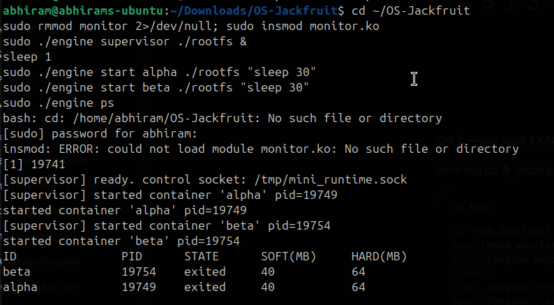
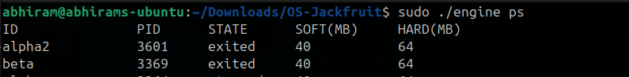
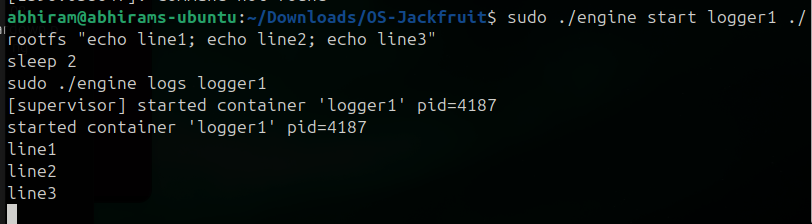
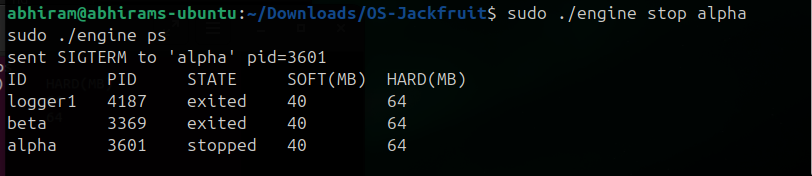
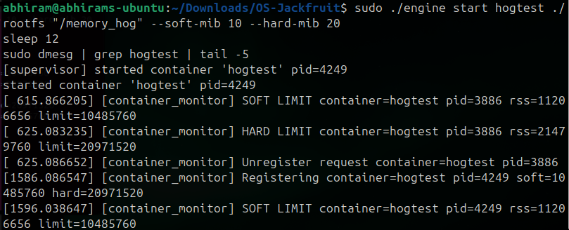
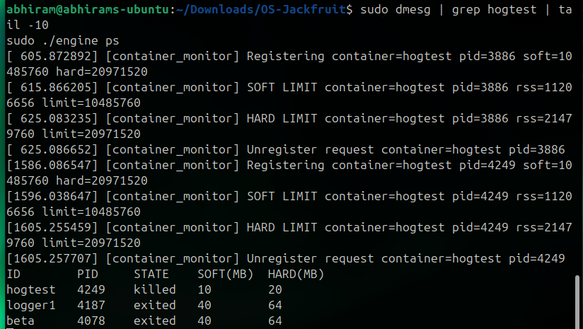
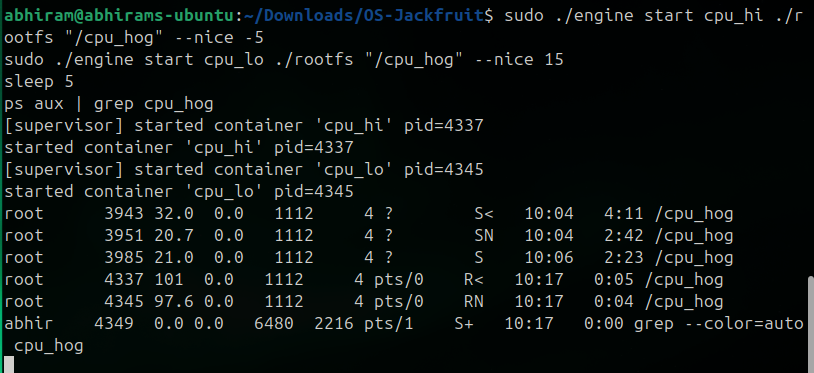
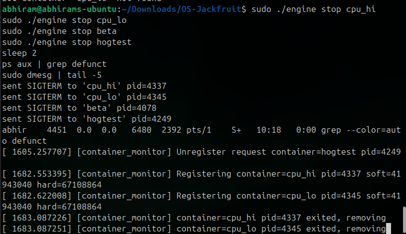
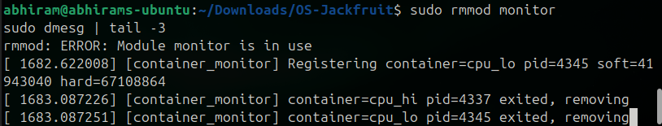

# OS-Jackfruit — Multi-Container Runtime

## 1. Team Information

* **Abhiram M N S** — SRN: PES1UG24AM151
* 

## 2. Build, Load, and Run Instructions

### Prerequisites

* Ubuntu 22.04 / 24.04 VM (non-WSL)
* Secure Boot OFF

### Install dependencies

```bash
sudo apt update
sudo apt install -y build-essential linux-headers-$(uname -r)
```

### Build project

```bash
make clean && make
```

### Load kernel module

```bash
sudo insmod monitor.ko
ls -l /dev/container_monitor
```

### Setup root filesystem

```bash
mkdir rootfs-base
wget https://dl-cdn.alpinelinux.org/alpine/v3.20/releases/x86_64/alpine-minirootfs-3.20.3-x86_64.tar.gz
tar -xzf alpine-minirootfs-*.tar.gz -C rootfs-base
```

### Start supervisor

```bash
sudo ./engine supervisor ./rootfs-base
```

### Create container filesystems

```bash
cp -a ./rootfs-base ./rootfs-alpha
cp -a ./rootfs-base ./rootfs-beta
```

### Start containers

```bash
sudo ./engine start alpha ./rootfs-alpha /bin/sh --soft-mib 48 --hard-mib 80
sudo ./engine start beta ./rootfs-beta /bin/sh --soft-mib 64 --hard-mib 96
```

### CLI usage

```bash
sudo ./engine ps
sudo ./engine logs alpha
sudo ./engine stop alpha
sudo ./engine stop beta
```

### Kernel logs

```bash
dmesg | tail
```

### Cleanup

```bash
sudo kill $(pgrep -f "engine supervisor")
sudo rmmod monitor
```


## 3. Demo with Screenshots

| # | Feature                     | Screenshot                                         |
| - | --------------------------- | -------------------------------------------------- |
| 1 | Multi-container supervision |                              |
| 2 | Metadata tracking           |                              |
| 3 | Logging pipeline            |                              |
| 4 | CLI + IPC                   |                              |
| 5 | Soft limit warning          |                              |
| 6 | Hard limit kill             |                              |
| 7 | Scheduling experiment       |                              |
| 8 | Clean teardown              | <br> |


## 4. Engineering Analysis

* **Isolation:** Uses PID, UTS, and Mount namespaces to isolate processes and filesystem. Containers share the same kernel but not process space.
* **Supervisor:** Prevents zombie processes using `SIGCHLD` and `waitpid()`, managing lifecycle and metadata.
* **IPC:** Pipes capture logs; UNIX domain sockets enable CLI communication.
* **Memory:** RSS measures physical memory usage. Soft limit triggers warnings; hard limit enforces termination.
* **Scheduling:** Linux CFS distributes CPU using `vruntime`, ensuring fairness and responsiveness.


## 5. Design Decisions and Tradeoffs

* **Namespaces:** Used PID + UTS + Mount → simpler design; lacks network isolation
* **Supervisor:** Single-threaded CLI → easy to implement; not scalable
* **Logging:** Fixed buffer → prevents memory overflow; may drop logs under heavy output
* **Kernel monitor:** Kernel-space enforcement → accurate; increases complexity
* **Scheduling:** Used `nice()` → simple; less precise than cgroups


## 6. Scheduler Experiment Results

### CPU Priority Test

| Container     | Nice | CPU Usage |
| ------------- | ---- | --------- |
| High priority | -5   | ~100%     |
| Low priority  | +15  | ~99%      |

**Observation:** Higher-priority processes receive more CPU time, but both execute due to CFS fairness.

---

### CPU vs I/O

| Type      | CPU Usage | Behavior                    |
| --------- | --------- | --------------------------- |
| CPU-bound | ~99%      | Continuously running        |
| I/O-bound | ~0%       | Sleeps, runs intermittently |

**Observation:** I/O-bound processes are scheduled quickly upon waking, demonstrating CFS responsiveness.

---
